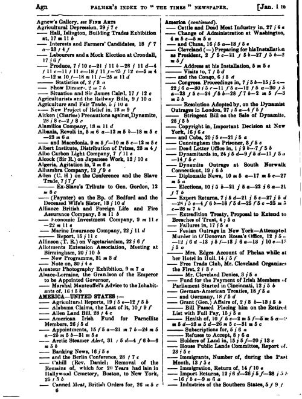

<h4 style="text-align:center;font-style:italic;margin-top:-20px;margin-bottom:50px;"><a href="../../maps/article-category">View Metadata Map</a></h4>

## Language Variants

Artikelkategorie; Artikelcategorie; Artikkeliluokka; Categoría de
artículo.

## Usage Notes

There are a wide range of different categories of article, broken
down into subject matter and format. The use of fixed [**headings**](../section-heading) from
[**issue**](../issue-number) to issue for topics such as provincial news, reviews,
advertisements and notices means that these are the most commonly used
categories in the databases. However, journalism and media history
provide a much more detailed list of categories of journalism that owes
much to nineteenth-century newspaper press directories, which first
appeared in a sustained way in the UK in the 1840s. *Mitchell’s
Newspaper Press Directory*, first published in 1846 (becoming an annual
publication in 1856), eventually included an index of topics. Palmer’s
*Index to The Times*, covering the period from 1790 to 1905, provided a
systematic index of the topics in that newspaper in which articles can
be located by broad subject headings, [**date of publication**](../date), or
[**title**](../newspaper-title) keywords.

The Gale collections have used the standard section headings from *The
Times* as a model for metadata categorisation of other papers because of
its relatively clear structure. In Delpher, section headings are
generated semi-automatically and checked by an operator.

## Examples:
  
  
> Sample page from Palmer's *Index to The Times Newspaper*, 1885 (Winter Quarter): 6.
> [Archive.org](https://archive.org/details/palmersindextot30unkngoog/page/n13/mode/2up). 
  
“A listing of the holdings of the National Library of India at
    Calcutta notes that the *Calcutta Star* contained: **Advertisements,
    Notices, Domestic occurrences, Commercial Intelligence, Shipping
    Intelligence, Bank shares, Price of Bullion, Rates of interest and
    discount, Literary articles, Sporting intelligence, Original
    correspondence, Editorial paragraphs, Orders of the Governor General
    in Council, European intelligence with special reference to England,
    House of Commons reports, Parliamentary miscellanea, Precis of
    miscellaneous events, Europe–births, marriages and deaths**. (‘South
    Asian Library and Research Notes’ 134–35)” \[Simons, 389\]

“Journalistic genres such as **news articles, editorial comment,
    foreign correspondence, political debate, court reports, financial
    bulletins, illustrations, sports coverage and even
    advertisements.**” \[Nicholson 2012, 277\]

“These authors wrote about **Society**, **social gossip**, and such
    women’s issues as **suffrage, temperance, poverty, married women’s
    property, health**, and **athleticism**, as well as **fashion,
    marriage, travel, fine art**, and **photography**.” \[Cogdill, 176\]

“On that day, the reader could find above the *feuilleton*, the
    ‘premier-Paris,’ an **editorial column** addressing the question
    of the Orient, as well as a collection of **news stories** about
    French foreign policies, **readers’ letters**, **news copied from
    foreign sources**, a series of **local crime reports**,
    **miscellaneous news items**, a mix of **advertisements for shows
    and bookstores**, **a list of those appointed to public office**, a
    summary of the **stock market activity**, a **list of
    entertainments**, and a series of **other advertisements**—all
    spread over four pages.” \[Thérenty, 35\]

“In a similar way as the five main classes of newspaper content,
    UIBK specifies text types or **genres of news** which appear in
    nearly every newspaper. Some typical examples are the
    ‘**Editorial**‘, a (subjective) statement of the publisher, the
    editor in chief with regard to a recent event or the political,
    economic or cultural situation in general. Another example are
    **book reviews**, which were first introduced in the early 19th
    century and are until today one of the classical articles in the
    ‘Feuilleton’ section of a newspaper. Other examples are **Death
    notices**, or **Job** and **Real Estate offers**.” \[Europeana
    Newspapers, 28\]

“artikkelin perustiedot ja artikkeliluokat”
