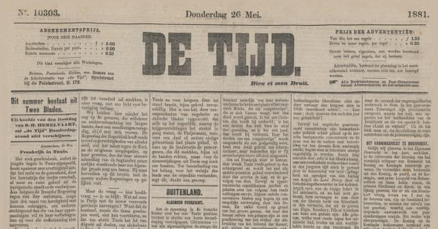
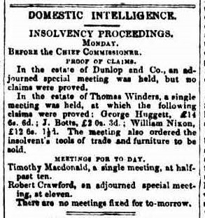

<h4 style="text-align:center;font-style:italic;margin-top:-20px;margin-bottom:50px;"><a href="../../maps/article-subheading">View Metadata Map</a></h4>

## Language Variants

Untertitel des Artikels; Ondertitel van artikel; Alaotsikko. 

## Usage Notes

Subheadings were not common in nineteenth-century journalism anywhere
until the later decades of the century. For example, in the UK, the
advent of New Journalism in the 1870s and 80s saw publishers beginning
to experiment with layout to attract a wider readership. Prior to
this, [**headlines**](../headline) were not common and even individual article titles
were relatively rare. Any reference to a subtitle would usually be
referring to a [**subtitle for the newspaper**](newspaper-subtitle). The term subheading
generally refers to any small headline inserted into a run of text.
There are two main styles: the crosshead, centred on the text below
it, and the sidehead, which is aligned to the left edge of the text.
Some Dutch and Spanish newspapers set subheadings aligned to the right
edge of the text. Europeana also allows for a top heading above the main
title, though this would usually not appear until the twentieth century.

## Examples:

> Example of crossheads in *De Tijd*, 26 May 1881. [Delpher](https://resolver.kb.nl/resolve?urn=ddd:010265778:mpeg21:p001).  
  
“Columns are basic units of design in newspapers and periodicals
    that distinguish serials from most printed books and predate later
    additions of page design such as tiered headlines, **subheads**,
    font variation and imaginative layout.” \[DNCJ, LRB/AK, 134\]

“ It may seem a simple matter to recommend the **sub-heading** as a
    relief to the reader in a column of text, yet this humble device has
    a curious way of arousing passion. There are newspaper designers
    today who regard it as a gimmick, a confession of design failure,
    just as the Victorian critics of the ‘New Journalism’ regarded it as
    a frivolous intrusion in an eight-column Budget speech.” \[Evans,
    107\]

“**Sub-headings** appear rather late in the first half of the 20th
    century.” \[Europeana Newspapers 2015, 40\]
    

> Example of sidehead used between crossheads in *The Sydney Morning Herald*, 23 June 1846: 2. [Trove](http://nla.gov.au/nla.news-page1518106).  
