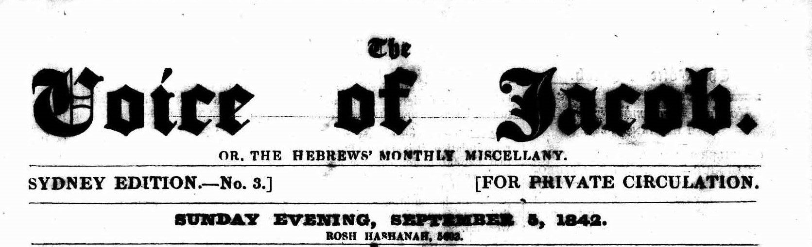

<h4 style="text-align:center;font-style:italic;margin-top:-20px;margin-bottom:50px;"><a href="../../maps/geographic-coverage">View Metadata Map</a></h4>

## Language Variants

Geographische Abdeckung; Verspreidingsgebied; Maantieteellinen
kattavuus; Cobertura geografica.

## Usage Notes

Researchers of the British and Australian press tend to group newspapers
as Rural, Provincial or Metropolitan Press, based on its [**place of
publication**](../place-of-publication) and where its reach was primarily felt. The Delpher
collection includes newspapers that were published in the Netherlands or
parts of the world that once belonged to the Kingdom of the Netherlands,
which includes the former colonies, the Dutch Indies, Suriname and the
Caribbean. There are exceptions, including newspapers of Dutch migrants
to the United States in the nineteenth and twentieth century, partly in
Dutch and later in English. The Trove collection began with one title
from each state and territory to start the archive, in order to be
representative. These were often the oldest or biggest newspaper from
each state. They are also in the process of expanding their collection
beyond Australia, digitising newspapers from countries including
Indonesia, Papua New Guinea, and the Pacific islands.

## Examples:

> Front page of the *Maidenhead Advertiser*, 28 July 1869. The masthead provides a list of towns in which the newspaper is distributed. [Wikimedia Commons](https://commons.wikimedia.org/wiki/File:Maidenhead-Advertiser-First-Newspaper-Edition.jpg).

“The letter campaign of 1894 was just the beginning of a life spent
    agitating for representation and equality for poor women. Nield’s
    career as an author began by writing anonymous letters to the
    **provincial press**…“ \[Bunting, 142\]

“Lady Greville likely did not attend the ball personally. Except for
    the by-line on her own article, her name is not mentioned in any of
    the (approximately 200) articles about the ball found so far, not
    even in the stories from newspapers like the ones that later
    published her obituary, with **regional** connections to her and the
    rest of her family.” \[Cogdill, 185\]

“The emphasis on annuals also obscures the significance of monthly
    periodicals and weekly **provincial** and **metropolitan**
    newspapers in the history of nineteenth-century women’s poetry.”
    \[Easley 2016a, 707\]

“The *Chronicle*, like many **town papers** of the era, brought
    national issues and trends to **regional** readers and carried
    general reports on progressive women’s issues of the day.”
    \[Bunting, 143\]

“Excellent in every department of journalism \[…\] so vast was his
    newspaper-reading that he never missed a noticeable point, not
    merely in **London**, but in the **provincial press**.” \[Yates,
    1.283\]

“A **geographical** edition is one of multiple publications issued
    at the same time by the same publisher and usually having the same
    title. The contents of the editions generally vary to include news
    from different cities, towns, or regions.” \[Sagendorf and Moore,
    6\]

“On syytä huomioida, että jakoalueen kuntien lukumäärä ei ole sama
    asia kuin suuri painos tai laaja maantieteellinen **kattavuus**“
  
  
  
> Masthead of *The Voice of Jacob. or, the Hebrews' Monthly Miscellany*, 5 September 1842: 17. Sydney edition. [Trove](https://trove.nla.gov.au/newspaper/page/22337446).
