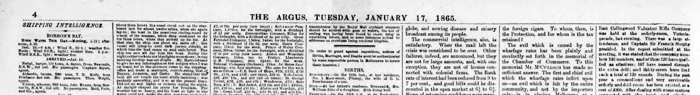

<h4 style="text-align:center;font-style:italic;margin-top:-20px;margin-bottom:50px;"><a href="../../maps/newspaper-title">View Metadata Map</a></h4>

## Language Variants

Titel der Zeitung; Krantentitel; (Sanoma)lehden nimi; Título del
periódico.

## Usage Notes

The term newspaper title is consistently applied across contemporary and
academic literature. It is sometimes also used metonymically to refer to
the newspaper or periodical as a whole. In the nineteenth century, the
term “title” was used to refer to the title printed on the masthead
for newspapers, magazines and other periodicals as well as for articles
in reference to the printed title. Newspaper titles appear in the
masthead on the front page (or title page) of a newspaper and in the
folio, a line at the top of each subsequent page that also includes
the date, the page number, and often a [**section title**](../section-heading). The title at
the top of the page could also be referred to as a running title. In
the nineteenth century, mastheads could also graphically represent the
[**geographic coverage**](../place-of-publication) of the publication, definitions of audience and
the themes and topics of the publication. In the British Library
collections, each title and title change is given a unique ID number,
which is included in the metadata for scanned newspapers.

During the nineteenth century, commentators might drop the article
(‘the’) when referring to newspaper titles but, as several
newspapers might have similar titles (e.g. *The Guardian, Preston
Guardian, Poor Man’s Guardian, The Guardian of Education*), the entire
title was generally used -- or a standardised shortened version (e.g.
*The Times* as compared to *The Times of London*).

## Examples:

### Referring to the name of the newspaper  

> Masthead of the *British Herald*, 1 January 1861.
> [Wikimedia Commons](https://commons.wikimedia.org/wiki/File:British_Herald.png).  
 
“A common feature of many Victorian periodicals and newspapers,
    **mastheads**, along with the **title pages** of volume reissues and
    part-issue wrappers and covers, sought to establish an instant
    ‘brand image’ for the journals they represented.” \[DNCJ, BM/AGJ,
    401\]

“**Masthead**: the **title** of the newspaper at the top of the
    front page.” \[Franklin, 201\]

“**Folio**: a line at the top of a page featuring the dateline, page
    number, the **name** of the newspaper and often a simple title
    indicating content, such as ‘news’, ‘comment’ or ‘sport’.”
    \[Franklin, 201\]
      

> Example of a folio from *The Argus*, 17 January 1865. [Trove](http://nla.gov.au/nla.news-page214586).
  
“From that point the newspaper’s **title**, which in previous issues
    appeared as it had since its inception, the *Watchman, and Jamaica
    Free Press*, ran simply as the *Jamaica Watchman*, dropping ‘Free
    Press.’” \[Ward, 2018\]

“The masthead includes the newspaper **title** statement found on
    the first, or front page. The masthead may also be called the
    nameplate, flag, or banner \[…\] In addition to naming the
    newspaper, the masthead may also state the edition, place of
    publication, designation, day of publication, the newspaper’s motto
    or philosophy, and the price. If the newspaper lacks a masthead,
    take the **title** from any source within the issue, and note the
    source from which the **title** was taken.” \[Sagendorf and Moore,
    9\]

“The **title** of the paper, *Illustrated London News*, had already
    been settled \[…\] the **title** heading to the paper engraved”
    \[Vizetelly, 1.226-27\]

“Within every newspaper issue some elements can be found which are
    not directly part of the content but are only included for providing
    some basic information to the user. These elements are mainly the
    **title** section, the **running title** and the imprint.”
    \[Europeana Newspapers 2015, 13\]

“Sometimes known as the **masthead**, the **titlepiece** is the most
    fiercely protected element of any newspaper.” \[Keeble and Reeves,
    29\]

“The source of the **title** is the masthead of the first or
    earliest available issue.” \[Sagendorf and Moore, 9\]

“Åbo Tidningarin, joksi Suomen ensimmäisen **lehden nimi** lyheni,
    …”

### Referring to the newspaper or periodical as a whole

“Happily, more titles have since appeared; while the number of pages
    across these platforms seems prodigious, the number of **titles**,
    as Leary noted, is only a tiny proportion of the ‘offline
    penumbra.’” \[Brake, 2015a, 249\]

“Some of the newspaper press directories—notably Mitchell’s and
    May’s—provided their readers with a huge, spectacular annual
    “Newspaper Map of the United Kingdom” showing the density of
    **titles** in given geographical centres…” \[Brake, 2015b, 570\]

“In 1861, one writer estimated that the number of newspapers in
    England had doubled from 562 to 1,102, although it was acknowledged
    that many of these **titles** were short lived.” \[O’Malley, 592\]

“This fluid network of print, in which titles change, merge,
    discontinue and spawn ever more **titles**, challenges us to think
    more critically about the coherence of any single serial title amid
    the stuttering rhythms of the marketplace.” \[Turner, 121\]
